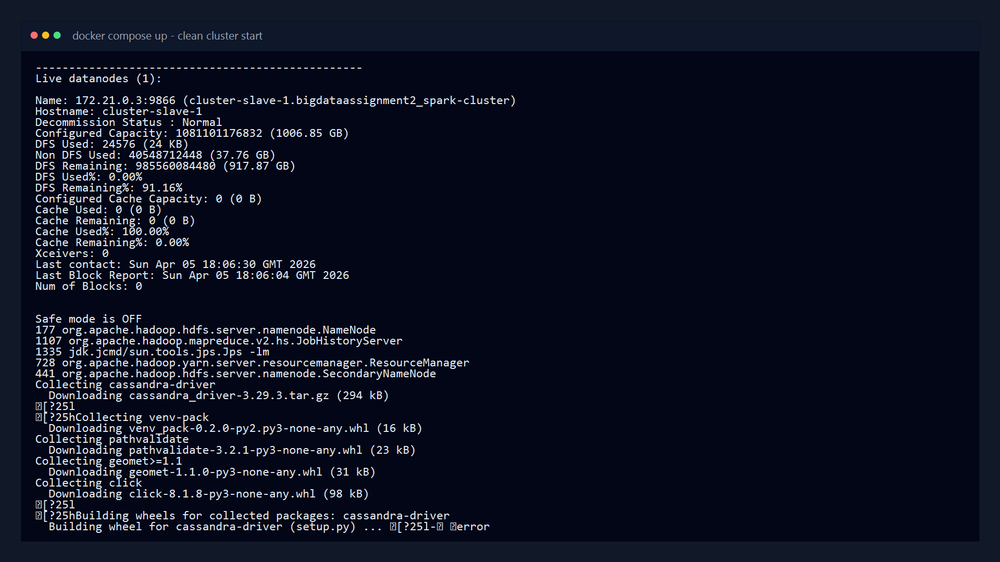
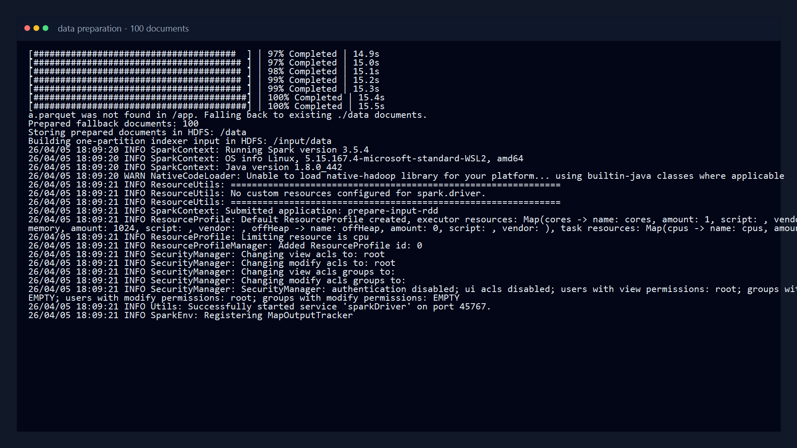
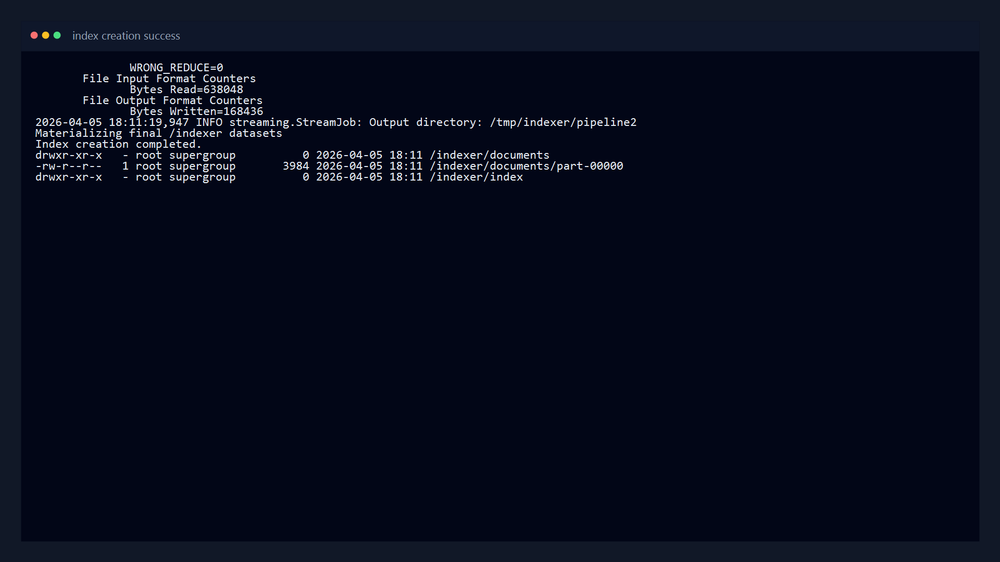
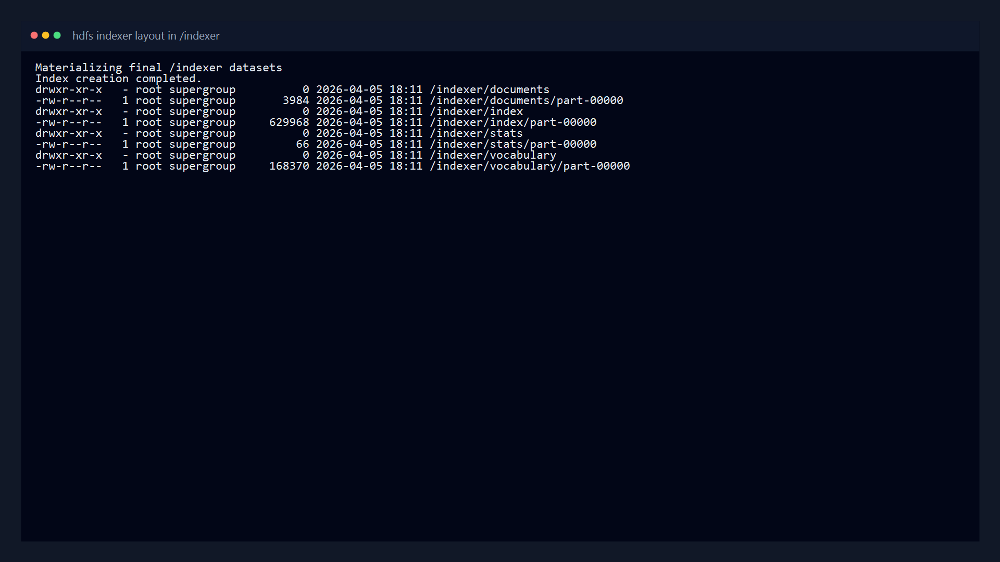
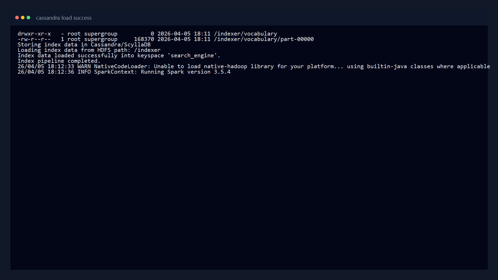
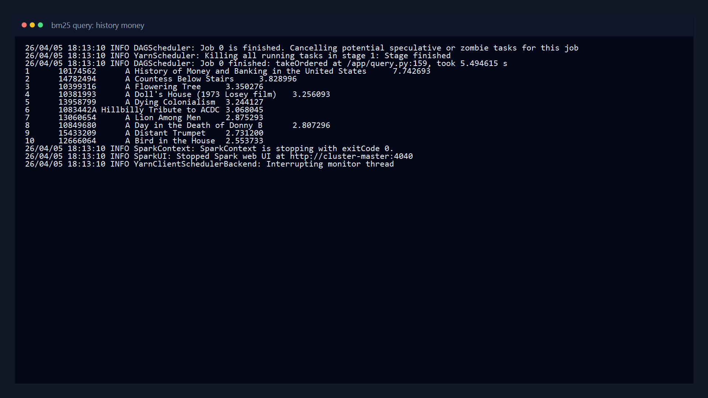
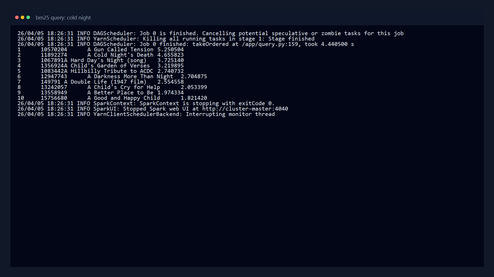
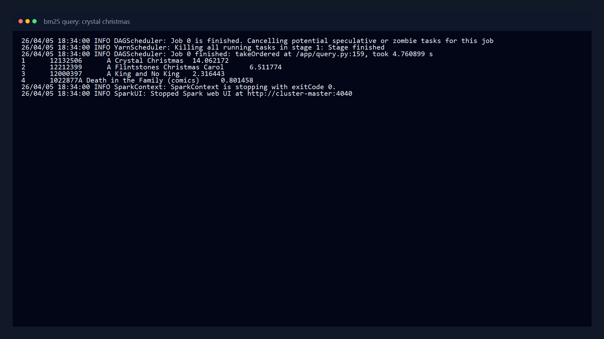

# Report
  
Student: _Egor Sergeev_  

## 1. Methodology

### 1.1 System Overview

This project implements a simple search engine with four main components:

1. Data preparation with PySpark.
2. Indexing with Hadoop MapReduce (Hadoop Streaming).
3. Index persistence in Cassandra.
4. Query ranking with BM25 using PySpark on YARN.

End-to-end flow:

`Parquet -> plain-text docs in HDFS (/data) -> one-partition index input (/input/data) -> MapReduce index (/indexer/*) -> Cassandra tables -> BM25 query top-10`

### 1.2 Data Collection and Preparation

Data preparation is implemented with PySpark and shell orchestration:

1. `prepare_data.py` reads parquet and selects only `id`, `title`, `text`.
2. Null/empty rows are filtered out.
3. Documents are written as UTF-8 plain text with naming format:
   `<doc_id>_<doc_title>.txt` (spaces replaced by `_`).
4. Files are uploaded to HDFS path `/data`.
5. `prepare_input_rdd.py` uses PySpark RDD (`wholeTextFiles`) to produce one partition in `/input/data` with each line as:
   `<doc_id>\t<doc_title>\t<doc_text>`

In this implementation, default document count is configured as **100**.

### 1.3 Indexer Design (MapReduce)

Indexer is implemented as two Hadoop Streaming pipelines:

#### Pipeline 1 (`mapper1.py`, `reducer1.py`)

Input: `/input/data` records (`doc_id`, `title`, `text`).

Processing:

1. Tokenize document text (lowercase regex tokenizer).
2. Compute term frequency (`tf`) per term per document.
3. Emit document-level length (`doc_len`).

Output records:

- `TERM    <term>    <doc_id>    <tf>`
- `DOC     <doc_id>  <title>     <doc_len>`

#### Pipeline 2 (`mapper2.py`, `reducer2.py`)

Input: pipeline 1 output.

Processing:

1. Compute document frequency `df(term)` for vocabulary.
2. Compute corpus-level statistics:
   - `N` (number of documents),
   - `TOTAL_DOC_LEN`,
   - `AVGDL`.

Output records:

- `VOCAB   <term>    <df>`
- `CORPUS  N                 <value>`
- `CORPUS  TOTAL_DOC_LEN     <value>`
- `CORPUS  AVGDL             <value>`

#### Final HDFS Layout

`create_index.sh` materializes the final index datasets as one partition per logical dataset:

- `/indexer/index`
- `/indexer/documents`
- `/indexer/vocabulary`
- `/indexer/stats`

Intermediate outputs are stored under `/tmp/indexer`.

### 1.4 Cassandra/ScyllaDB Storage Design

`store_index.sh` runs `app.py` to load HDFS index outputs into Cassandra keyspace `search_engine`.

Tables:

1. `vocabulary(term PRIMARY KEY, df)`
2. `documents(doc_id PRIMARY KEY, title, doc_len)`
3. `postings((term), doc_id, tf)`  
   Partition key is `term`, clustering key is `doc_id`.
4. `corpus_stats(stat PRIMARY KEY, value)`

Design rationale:

1. Query-time lookup is term-centric, so partitioning postings by term minimizes read scope.
2. Vocabulary and corpus stats are compact and directly used in BM25 scoring.
3. Document metadata is separated for clean retrieval of title/doc length.

### 1.5 Ranker Design (BM25)

`query.py` is a PySpark application that:

1. Reads query text from command line or stdin.
2. Tokenizes query terms.
3. Reads `df`, postings, document metadata, and corpus stats from Cassandra.
4. Computes BM25 score per `(query term, document)`.
5. Aggregates scores per document and returns top 10 by descending score.

Used BM25 parameters:

- `k1 = 1.2`
- `b = 0.75`

Formula applied:

`score = idf * ((tf * (k1 + 1)) / (tf + k1 * (1 - b + b * dl / avgdl)))`

where:

- `idf = log(1 + (N - df + 0.5)/(df + 0.5))`

### 1.6 Design Choices and Reflections

1. Two-pipeline MapReduce design keeps responsibilities clear:
   Pipeline 1 for postings/doc stats, Pipeline 2 for corpus/vocabulary stats.
2. Keeping `/input/data` as one partition makes pipeline input deterministic and easy to debug.
3. Cassandra schema is optimized for term-first retrieval required by BM25.
4. The implementation prioritizes correctness and reproducibility over advanced IR optimizations (stemming, stop-word filtering, phrase matching).

## 2. Demonstration

### 2.1 How to Run the Repository

Prerequisites:

1. Docker
2. Docker Compose

Run (PowerShell):

```powershell
docker compose up
```

This will:

1. Start Hadoop services.
2. Prepare 100 documents and build `/input/data`.
3. Run index creation (`create_index.sh` + `store_index.sh` via `index.sh`).

To run with a sample query automatically:

```powershell
$env:RUN_SAMPLE_QUERY="1"
$env:SAMPLE_QUERY="history money"
docker compose up --force-recreate cluster-master cluster-slave-1
```

### 2.2 Fullscreen Screenshots









### 2.3 Query Results and Explanation

Query 1: `history money`

1. `10174562    A History of Money and Banking in the United States`
2. `14782494    A Countess Below Stairs`
3. `10399316    A Flowering Tree`

Query 2: `cold night`

1. `10570204    A Gun Called Tension`
2. `11892274    A Cold Night's Death`
3. `1067891     A Hard Day's Night (song)`

Query 3: `crystal christmas`

1. `12132506    A Crystal Christmas`
2. `12212399    A Flintstones Christmas Carol`
3. `12000397    A King and No King`

Interpretation:

1. BM25 prioritizes exact term overlap and term rarity; this is visible in the first results for all three queries.
2. Query 3 returns fewer matches because the term combination is much more specific in this 100-document subset.
3. Scores and ranking behavior are consistent with BM25 length normalization and tf saturation.

### 2.4 Reflections

1. The architecture is modular and easy to reason about for assignment grading.
2. The MapReduce + Cassandra + PySpark combination works well for batch indexing and query-time scoring.
3. Main potential improvements:
   - add normalization/stemming,
   - add stop-word filtering,
   - support incremental indexing (`add_to_index.sh` optional task).
